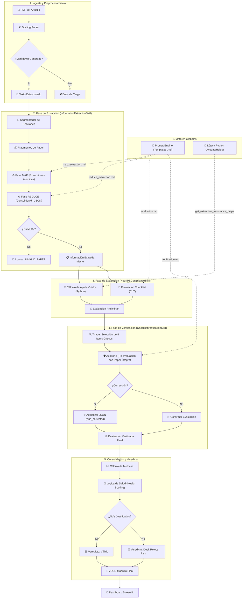

# 🤖 NeurIPS 2026 Paper Auditor: Arquitectura y Flujo de Trabajo

Este documento describe detalladamente el funcionamiento interno del auditor de artículos científicos, desde la ingesta del documento hasta la generación del informe de cumplimiento final. El sistema utiliza una arquitectura de **Skills** (habilidades) coordinadas en un pipeline secuencial de 5 fases.

## 🌟 Descripción General
El **NeurIPS 2026 Paper Auditor** evalúa la transparencia y reproducibilidad de papers de IA/ML siguiendo los criterios oficiales de **NeurIPS 2026**. Su motor combina razonamiento Chain-of-Thought (CoT), arquitectura Map-Reduce para documentos extensos y un sistema de verificación cruzada ("Auditor 2") para minimizar falsos positivos.

## 🏗️ Arquitectura del Sistema
El sistema se basa en una arquitectura modular de servicios y habilidades:

- **Frontend (Streamlit)**: Orquesta la carga, visualización de fases en tiempo real y el dashboard final.
- **Auditor Service (`PaperAuditor`)**: El orquestador principal que gestiona el contexto y la ejecución secuencial de las fases.
- **Skills Layer**: Habilidades especializadas que ejecutan tareas atómicas de IA o cálculo determinista.
- **Prompt Engine**: Sistema centralizado de plantillas Markdown para garantizar respuestas estructuradas en JSON.

## 📊 Diagrama de Flujo del Agente

A continuación se detalla el flujo de datos y la lógica de decisión del agente auditor, desde la ingesta del documento hasta la generación del informe final.

---

### ⏱️ Cronología de Ejecución de Prompts
Para entender el flujo temporal del agente:
1.  **`map_extraction.md`** (Múltiple): Una vez por cada sección del paper.
2.  **`reduce_extraction.md`** (1 vez): Para consolidar los hechos.
3.  **`evaluation.md`** (1 vez): El juicio inicial de los 16 ítems.
4.  **`verification.md`** (Hasta 8 veces): El "Auditor 2" revisando puntos críticos.

---

## 🚀 Pipeline de Auditoría: Detalle de las 5 Fases

### 1. Extracción General (`InformationExtractionSkill`)
Es la base del análisis. Utiliza un enfoque de **Map-Reduce** para procesar papers de cualquier longitud sin pérdida de contexto.

- **Inputs**: 
    - `paper_text` (Texto completo extraído por Docling).
    - `map_extraction.md` (Template para análisis de fragmentos).
    - `reduce_extraction.md` (Template para consolidación global).
- **Proceso**:
    - **Fase MAP (Extracción Segmentada)**: El paper se divide en secciones lógicas (usando encabezados `#` de Docling). Cada segmento se envía a un LLM para extraer entidades, metodología, hardware y contexto técnico.
    - **Fase REDUCE (Consolidación)**: Un segundo paso de síntesis unifica las extracciones, resuelve contradicciones y genera un objeto maestro.
    - **Validación de Dominio**: Si el modelo detecta que el paper no es de ML/AI, aborta la ejecución con un error `INVALID_PAPER_TYPE`.
- **Outputs**: `extracted_info` (JSON global), `map_steps` (detalles por bloque), `invalid_paper` (boolean).
- **Modelos**: `Gemini 3.1 Flash Lite`.

### 2. Evaluación NeurIPS (`NeurIPSComplianceSkill`)
Transforma la información técnica extraída en juicios de cumplimiento normativo.

- **Inputs**: 
    - `extracted_info` (JSON maestro de la Fase 1).
    - `evaluation_helps` (Pistas técnicas generadas por Python).
    - `evaluation.md` (Template con los criterios oficiales NeurIPS 2026).
- **Proceso**:
    - **Ayudas del Extractor (Helps)**: Antes de la evaluación profunda, un puente de Python genera ayudas de ayuda (`evaluation_helps`) que mapean hechos técnicos a reglas de NeurIPS para pre-calentar al evaluador.
    - **Evaluación Normativa**: Aplica los criterios de NeurIPS 2026 sobre la información consolidada para generar respuestas preliminares (`Yes`, `No`, `N/A`) con su respectiva evidencia y justificación.
- **Outputs**: `evaluation` (Checklist preliminar), `evaluation_helps`.
- **Modelo**: `Gemini 3.1 Flash Lite`.

### 3. Auditoría Estricta / Auditor 2 (`ChecklistVerificationSkill`)
Un sistema de **Self-Correction** que actúa como un segundo revisor senior para garantizar la máxima fidelidad y cazar alucinaciones.

- **Inputs**: 
    - `evaluation` (Borrador de la Fase 2).
    - `paper_text` (Texto original para búsqueda de evidencias).
    - `verification.md` (Instrucciones de auditoría y detección de alucinaciones).
- **Proceso**:
    - **Lógica de Triage**: No verifica los 16 ítems para optimizar tiempo/coste. Selecciona un máximo de **8 ítems** prioritarios:
        1.  **Ítems Críticos**: Siempre revisa reproducibilidad, código, datos, hardware, estadística, ética y uso de LLMs.
        2.  **Banderas Rojas**: Prioriza cualquier ítem marcado como "No" o "N/A" para verificar que no sea un falso negativo.
    - **Verificación contra Fuente**: El "Auditor 2" consulta directamente el texto original del paper (ventana de 60k tokens: 30k iniciales + 30k finales) para validar si el primer auditor omitió algo.
    - **Refinamiento Técnico**: Actualiza respuestas y añade el flag `was_corrected: true` si hay cambios.
- **Outputs**: `evaluation` (Checklist verificado y corregido).
- **Modelo**: `Gemini 3.1 Flash Lite` (con configuración determinista).

### 4. Consolidación de Métricas (`MetricsCalculationSkill`)
Fase de cálculo determinista para medir la eficiencia del proceso.

- **Inputs**: `paper_text`, `execution_time`.
- **Proceso**:
    - Calcula estadísticas de rendimiento: tiempo total, velocidad de procesamiento (tokens/segundo) y volumen de datos analizados.
- **Outputs**: `metrics` (Metadatos de rendimiento).

### 5. Generación de Informe Final (`MetadataAggregationSkill`)
Fase de cierre que consolida el conocimiento para el dashboard.

- **Inputs**: Todo el contexto acumulado de las fases 1-4.
- **Proceso**:
    - **Lógica de Veredicto (Health Score)**:
        - **🟢 Checklist Válido**: Si todos los "No" tienen una justificación válida extraída del paper (`is_no_justified: true`).
        - **🔴 Riesgo de Desk Reject**: Si hay ítems en "No" sin justificación del autor.
    - **Empaquetado**: Agrega metadatos finales y estructura el JSON final.
- **Outputs**: Objeto JSON final con veredicto, métricas, helps y checklist verificado.

---

## 🧠 Desarrollo Técnico de las Skills

A continuación se detalla la lógica interna de "bajo nivel" de cada componente del agente:

### 🔍 Skill de Extracción (Map-Reduce + Domain Triage)
Esta skill es la más compleja debido a la variabilidad de tamaño de los papers.
1.  **Segmentación Inteligente**: En lugar de usar trozos por caracteres, detecta los encabezados de Docling (`#`, `##`) para agrupar fragmentos por secciones reales (Abstract, Intro, Method, etc.).
2.  **Fase MAP**: Ejecuta llamadas paralelas al LLM (`Gemini 1.5 Flash`) para cada fragmento, extrayendo una mini-estructura JSON con contexto local.
3.  **Fase REDUCE**: Unifica las extracciones locales. Si hay discrepancias (ej. la Intro dice una cosa y los Apéndices otra), el prompt de REDUCE prioriza la evidencia técnica de las secciones de "Experimentación".
4.  **Triage de Dominio**: Realiza una clasificación tipo "zero-shot" para asegurar que el contenido es científico-técnico de IA.

### ⚖️ Skill de Cumplimiento (Evaluación Normativa)
Transforma hechos técnicos en cumplimiento de reglas NeurIPS.
1.  **Ayudas del Extractor (Helps)**: Antes de la evaluación profunda, un puente de Python lee el JSON de la Fase 1 y genera pistas de ayuda (`evaluation_helps`) sobre la presencia de palabras clave (ej. "MIT License", "GitHub", "p < 0.05") para pre-calentar al evaluador.
2.  **Chain-of-Thought (CoT)**: Obliga al LLM a generar un campo `thought_process` antes de decidir el estado `Yes/No`. Esto mejora drásticamente la precisión en criterios abstractos como "Broader Impacts".

### 🛡️ Skill de Verificación (Auditor 2 / Self-Correction)
Actúa como un filtro de calidad crítico.
1.  **Selección de Items**: No verifica todo el checklist para optimizar costes. Selecciona los 8 ítems más propensos al error o aquellos marcados como "No".
2.  **Ventana de Contexto Amplia**: A diferencia de la extracción, esta fase envía el ítem específico junto con una ventana de 60,000 caracteres (aprox. 15-20 páginas) para una búsqueda exhaustiva.
3.  **Lógica de Corrección**: Si el Auditor 2 encuentra evidencia que contradice la Fase 2, sobrescribe el estado y añade un flag `verified: true` y `was_corrected: true`, lo que se visualiza con un icono especial en el dashboard.

### 📊 Skills de Soporte (Métricas y Metadatos)
- **Métricas**: Calcula el rendimiento en tiempo total y volumen de datos, permitiendo auditar la eficiencia del sistema.
- **Metadatos**: Mapea las respuestas técnicas al esquema Pydantic `AuditState` para garantizar estabilidad en el frontend.
- **Veredicto**: Aplica la heurística de "Transparencia NeurIPS": un "No" solo es aceptable si el paper explica explícitamente la omisión (ej. "No proporcionamos código por razones de privacidad comercial").

---

## 🛠️ Tecnologías y Stack Técnico

- **LLM Core**: Familia **Gemini 3.1 Flash Lite** (optimizado para latencia y razonamiento técnico en JSON).
- **Context Handling**: Ventanas de hasta 1M tokens con técnicas de Map-Reduce y Ventanas Deslizantes.
- **PDF Intelligence**: **Docling (IBM)** para preservación de semántica y estructura Markdown.
- **Prompting**: Arquitectura **Markdown-to-JSON** con validación estricta de esquemas.
- **Frontend**: Streamlit 2026 con componentes personalizados en HTML/CSS para visualización de "signals".

## 📊 Ciclo de Vida del Contexto
1. **Raw Text**: 100% del documento (Docling).
2. **Context Mapping**: Identificación de anclas (Fase 1).
3. **Structured Context**: Extracción consolidada (Fase 1-2).
4. **Verified Evidence**: Citas textuales validadas (Fase 3).
5. **Insights**: Dashboard visual final (Fase 5).

