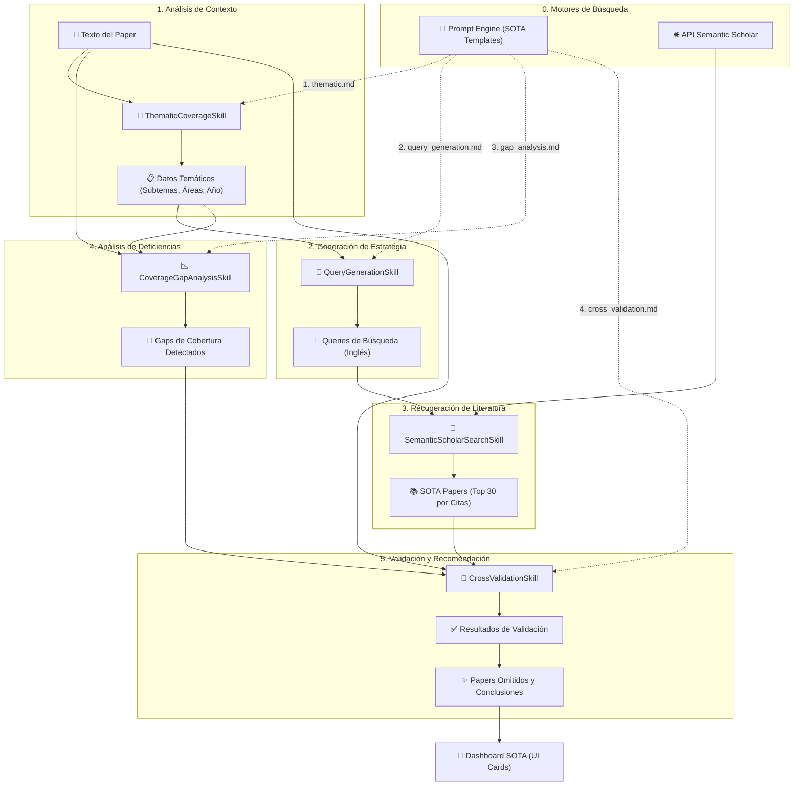

# 🔬 SOTA Agent: Arquitectura y Flujo de Análisis Bibliográfico

Este documento describe el funcionamiento interno del agente de Estado del Arte (SOTA), diseñado para identificar literatura científica relevante, detectar omisiones bibliográficas y analizar la cobertura temática de los artículos de IA/ML.

## 🌟 Descripción General
El **SOTA Agent** actúa como un bibliotecario experto impulsado por IA. Su objetivo no es solo encontrar papers relacionados, sino validar si el autor del artículo analizado ha ignorado trabajos críticos o si existen "gaps" (huecos) en su argumentación técnica basándose en el estado actual de la investigación (2023-2026).

## 🏗️ Arquitectura del Sistema
El agente sigue una arquitectura de micro-servicios basada en **Skills**, coordinada por el `SotaAnalyzer`:

- **Sota Service (`SotaAnalyzer`)**: Orquestador que gestiona el estado y el flujo de datos entre habilidades.
- **Skills Layer**: Componentes atómicos que interactúan con LLMs o APIs externas (Semantic Scholar).
- **External API (Semantic Scholar)**: Fuente de datos para la recuperación de literatura de alto impacto.
- **Prompt Engine**: Plantillas Markdown especializadas para análisis temático y validación cruzada.

## 📊 Diagrama de Flujo del Agente SOTA

El siguiente diagrama detalla cómo el agente transforma el texto de un paper en un informe de recomendaciones y validación bibliográfica.

---

### ⏱️ Cronología de Ejecución
1.  **`1. thematic.md`**: Identifica de qué trata el paper.
2.  **`2. query_generation.md`**: Traduce temas a términos de búsqueda técnica.
3.  **Llamada API SS**: Recupera candidatos reales de la web científica.
4.  **`3. gap_analysis.md`**: Compara la bibliografía del autor con los temas del paper.
5.  **`4. cross_validation.md`**: Cruza los resultados de búsqueda con el paper para detectar omisiones específicas.

---

## 🚀 Pipeline SOTA: Detalle de las 5 Fases

### 1. Cobertura Temática (`ThematicCoverageSkill`)
Analiza el "ADN" técnico del paper para guiar las fases posteriores.

- **Inputs**: 
    - `paper_text` (Texto completo del artículo).
    - `1. thematic.md` (Plantilla para identificación temática).
- **Proceso**: El LLM extrae los subtemas específicos (ej. "DPO tuning", "Reasoning traces"), las áreas técnicas generales (ej. "LLM Alignment") y el año de publicación para contextualizar la búsqueda.
- **Outputs**: `thematic_data` (JSON con subtemas, áreas y año).
- **Modelo**: `Gemini 3.1 Flash Lite`.

### 2. Generación de Queries (`QueryGenerationSkill`)
Convierte el contexto técnico en una estrategia de búsqueda efectiva.

- **Inputs**: 
    - `thematic_data` (JSON de la Fase 1).
    - `paper_text` (Snippet para contexto).
    - `2. query_generation.md` (Plantilla para generación de queries).
- **Proceso**: Genera entre 3 y 5 queries de búsqueda en inglés, optimizadas para la API de Semantic Scholar, utilizando terminología técnica avanzada.
- **Outputs**: `search_queries` (Lista de strings).
- **Modelo**: `Gemini 3.1 Flash Lite`.

### 3. Búsqueda Semántica (`SemanticScholarSearchSkill`)
Recuperación determinista de literatura de alta calidad.

- **Inputs**: `search_queries`.
- **Proceso**:
    - Ejecuta búsquedas paralelas en Semantic Scholar.
    - Filtra resultados por relevancia y año (2023-2026 por defecto).
    - **Ranking**: Ordena los resultados por `citationCount` para priorizar trabajos de alto impacto.
    - **Deduplicación**: Limpia resultados repetidos entre diferentes queries.
- **Outputs**: `sota_papers` (Lista de hasta 30 objetos Paper).
- **Tecnología**: API REST de Semantic Scholar.

### 4. Análisis de Gaps (`CoverageGapAnalysisSkill`)
Identifica debilidades en la revisión de literatura del autor.

- **Inputs**: 
    - `paper_text` (Texto completo).
    - `thematic_data` (JSON de la Fase 1).
    - `3. gap_analysis.md` (Plantilla para análisis de deficiencias bibliográficas).
- **Proceso**: El agente revisa la sección de "Related Work" y las citas del paper original para identificar qué subtemas técnicos no están suficientemente respaldados bibliográficamente.
- **Outputs**: `coverage_gaps` (Áreas débiles identificadas).
- **Modelo**: `Gemini 3.1 Flash Lite`.

### 5. Validación Cruzada (`CrossValidationSkill`)
El "juez final" que decide qué papers del SOTA real faltan en el artículo.

- **Inputs**: 
    - `paper_text` (Texto original y referencias).
    - `sota_papers` (Resultados de Semantic Scholar de la Fase 3).
    - `coverage_gaps` (Gaps detectados en la Fase 4).
    - `4. cross_validation.md` (Plantilla para validación cruzada final).
- **Proceso**:
    - Compara los títulos y abstracts de los papers encontrados contra el texto completo del manuscrito analizado.
    - Filtra falsos positivos (papers que sí están citados pero con nombres ligeramente distintos).
    - Genera una justificación técnica de por qué cada paper omitido es relevante.
- **Outputs**: `validation_results` (Papers omitidos, nivel de cobertura, conclusión final).
- **Modelo**: `Gemini 3.1 Flash Lite`.

---

## 🧠 Desarrollo Técnico de las Skills

### 🔍 Inteligencia en Búsqueda (Semantic Scholar)
El sistema no solo busca palabras clave, sino que aplica filtros inteligentes:
1.  **Filtro de Actualidad**: Prioriza papers publicados entre 2023 y el año actual para asegurar que las recomendaciones sean SOTA real.
2.  **Filtro de Impacto**: Al limitar a 30 resultados ordenados por citaciones, el agente actúa como un filtro de ruido, enfocándose en la "literatura canónica" del área.

### ⚖️ Lógica de Validación de Omisiones
Para evitar recomendaciones irrelevantes o alucinadas:
- **Abstract Matching**: El LLM analiza el abstract del paper candidato para confirmar que su metodología o hallazgos realmente impactan el trabajo analizado.
- **Detección de Citas Implícitas**: El agente busca en las referencias del paper original para asegurar que el paper "omitido" no esté ya incluido bajo otro nombre o autor principal.

### 📊 Presentación de Resultados (UI)
El resultado final se visualiza en el Dashboard mediante:
- **Cards de Recomendación**: Con links directos a Semantic Scholar, conteo de citas y año.
- **Radar de Cobertura**: Visualización de qué áreas técnicas están bien cubiertas y cuáles son "gaps".
- **Veredicto SOTA**: Una conclusión ejecutiva sobre la solidez bibliográfica del manuscrito.

---

## 🛠️ Tecnologías y Stack Técnico

- **LLM Core**: **Gemini 3.1 Flash Lite** (por su excelente desempeño en manejo de contexto largo y extracción de JSON).
- **API Bibliográfica**: **Semantic Scholar API** (Official Partner).
- **Parsing**: **Docling** para identificar secciones de referencias y literatura relacionada.
- **Frontend**: Streamlit con componentes CSS personalizados para el renderizado de bibliografía.
