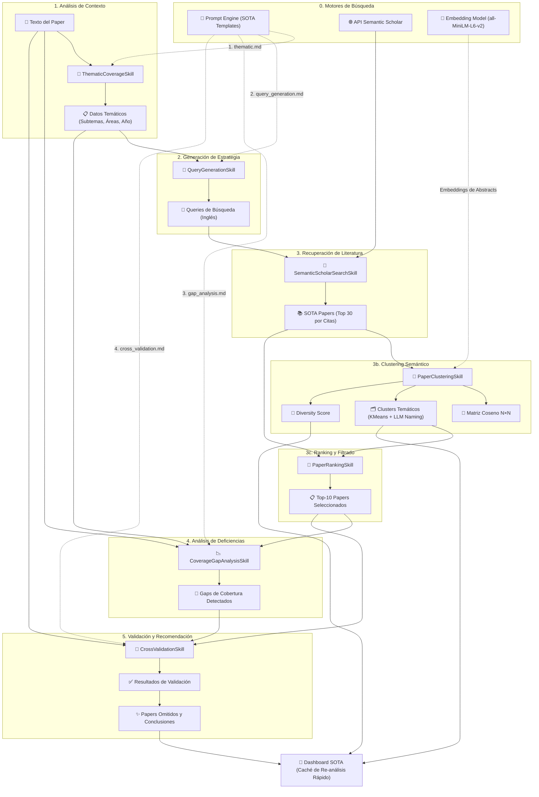

# 🔬 SOTA Agent: Arquitectura y Flujo de Análisis Bibliográfico

Este documento describe el funcionamiento interno del agente de Estado del Arte (SOTA), diseñado para identificar literatura científica relevante, detectar omisiones bibliográficas, **analizar la similitud semántica entre los papers recuperados** y agruparlos en familias temáticas.

## 🌟 Descripción General
El **SOTA Agent** actúa como un bibliotecario experto impulsado por IA. Su objetivo no es solo encontrar papers relacionados, sino:
1. Validar si el autor ha ignorado trabajos críticos del estado del arte.
2. Detectar "gaps" en la argumentación técnica basándose en la investigación reciente (2023-2026).
3. **Medir la diversidad temática del corpus recuperado** y agrupar los papers por familias semánticas mediante clustering.

## 🏗️ Arquitectura del Sistema
El agente sigue una arquitectura de micro-servicios basada en **Skills**, coordinada por el `SotaAnalyzer`:

- **Sota Service (`SotaAnalyzer`)**: Orquestador que gestiona el estado y el flujo de datos entre habilidades.
- **Skills Layer**: Componentes atómicos que interactúan con LLMs, APIs externas o modelos de embeddings locales.
- **External API (Semantic Scholar)**: Fuente de datos para la recuperación de literatura de alto impacto.
- **Prompt Engine**: Plantillas Markdown especializadas para análisis temático y validación cruzada.
- **Embedding Model (`all-MiniLM-L6-v2`)**: Modelo local ligero (~80 MB) para generar representaciones vectoriales de abstracts.

## 📊 Diagrama de Flujo del Agente SOTA

El siguiente diagrama detalla cómo el agente transforma el texto de un paper en un informe de recomendaciones, validación bibliográfica y análisis de clustering.

---

### ⏱️ Cronología de Ejecución
1. **`1. thematic.md`**: Identifica de qué trata el paper.
2. **`2. query_generation.md`**: Traduce temas a términos de búsqueda técnica.
3. **Llamada API SS**: Recupera candidatos reales de la web científica.
4. **`PaperClusteringSkill`**: Embebe abstracts, calcula similitud coseno, agrupa por clusters usando KMeans y nombra descriptivamente con el LLM.
5. **`PaperRankingSkill`**: Selecciona el "Top-10" usando el criterio elegido (Citas, Similitud o LLM) y permite filtrar por un clúster específico.
6. **`3. gap_analysis.md`**: Compara la bibliografía del autor con los temas del paper, enfocándose en el top-10.
7. **`4. cross_validation.md`**: Cruza los resultados de búsqueda (top-10) con el paper para detectar omisiones específicas.

*Nota: La arquitectura permite **Re-análisis en Caché**. Si el usuario cambia el criterio de ranking o el clúster desde la UI, el sistema salta directamente al paso 5 recuperando los datos en memoria, actualizándose instantáneamente (ahorra ~15-20s).*

---

## 🚀 Pipeline SOTA: Detalle de las 6 Fases

### 1. Cobertura Temática (`ThematicCoverageSkill`)
Analiza el "ADN" técnico del paper para guiar las fases posteriores.

- **Inputs**:
    - `paper_text` (Texto completo del artículo).
    - `1. thematic.md` (Plantilla para identificación temática).
- **Proceso**: El LLM extrae los subtemas específicos (ej. "DPO tuning", "Reasoning traces"), las áreas técnicas generales (ej. "LLM Alignment") y el año de publicación para contextualizar la búsqueda.
- **Outputs**: `thematic_data` (JSON con subtemas, áreas y año).
- **Modelo**: `Gemini 3.1 Flash Lite`.

### 2. Generación de Queries (`QueryGenerationSkill`)
Convierte el contexto técnico en una estrategia de búsqueda efectiva.

- **Inputs**:
    - `thematic_data` (JSON de la Fase 1).
    - `paper_text` (Snippet para contexto).
    - `2. query_generation.md` (Plantilla para generación de queries).
- **Proceso**: Genera entre 3 y 5 queries de búsqueda en inglés, optimizadas para la API de Semantic Scholar, utilizando terminología técnica avanzada.
- **Outputs**: `search_queries` (Lista de strings).
- **Modelo**: `Gemini 3.1 Flash Lite`.

### 3. Búsqueda Semántica (`SemanticScholarSearchSkill`)
Recuperación determinista de literatura de alta calidad.

- **Inputs**: `search_queries`.
- **Proceso**:
    - Ejecuta búsquedas paralelas en Semantic Scholar.
    - Filtra resultados por relevancia y año (2023-2026 por defecto).
    - **Ranking**: Ordena los resultados por `citationCount` para priorizar trabajos de alto impacto.
    - **Deduplicación**: Limpia resultados repetidos entre diferentes queries.
- **Outputs**: `sota_papers` (Lista de hasta 30 objetos Paper).
- **Tecnología**: API REST de Semantic Scholar.

### 3b. Clustering Semántico (`PaperClusteringSkill`)
Analiza la similitud entre los papers recuperados y los agrupa en familias temáticas.
Esta fase es **completamente local** (no requiere LLM ni API externa) y se ejecuta tras la búsqueda.

- **Inputs**: `sota_papers` (lista enriquecida con abstract y título).
- **Proceso**:
    1. **Embeddings**: Codifica el abstract (o título como fallback) de cada paper usando `sentence-transformers/all-MiniLM-L6-v2` (primera ejecución descarga ~80 MB, se cachea localmente).
    2. **Matriz Coseno N×N**: Calcula `sklearn.metrics.pairwise.cosine_similarity` entre todos los pares de embeddings. Valores en [0, 1]; 1 = idénticos semánticamente.
    3. **Diversity Score**: `1 − media_similitud_off_diagonal`. Cuantifica cuán variado es el corpus recuperado.
        - `≥ 0.75` → Alta diversidad (búsqueda variada, cubre múltiples enfoques).
        - `0.45–0.75` → Diversidad media.
        - `< 0.45` → Baja diversidad (papers muy similares; posible sesgo en las queries).
    4. **KMeans Clustering**: Agrupa los papers en *k* clusters. El número *k* se elige heurísticamente según el tamaño del corpus:
        | N papers | k clusters |
        |----------|-----------|
        | ≤ 4      | 2         |
        | 5–8      | 3         |
        | 9–15     | 4         |
        | 16–25    | 5         |
        | > 25     | 6         |
    5. **Anotación (Segunda Pasada - LLM)**: Tras el KMeans, se extraen los títulos de cada cluster y se envían al LLM en un único prompt para que genere un **nombre descriptivo humano** (ej. "Generative Adversarial Networks") y un **emoji representativo** para cada familia temática.
- **Outputs**:
    - `sota_papers` enriquecidos con metadatos de cluster.
    - `similarity_matrix` (lista N×N serializable).
    - `diversity_score` (float).
    - `cluster_summary` (dict `cluster_id → {label, color, emoji, paper_titles}`).
    - `user_similarities` (Similitud coseno exacta de cada paper contra el texto del usuario).
- **Tecnología**: `sentence-transformers` + `scikit-learn` + LLM (para Nombrado).

### 3c. Ranking y Filtrado Temático (`PaperRankingSkill`)
Reduce el universo total recuperado (ej. 20 papers) a los N (Top-10) más relevantes sobre los que se hará el análisis crítico profundo.

- **Inputs**: `sota_papers`, `ranking_criterion`, `target_cluster_id`.
- **Proceso**:
    1. **Filtrado**: Si el usuario seleccionó un clúster específico, elimina temporalmente el resto de papers.
    2. **Ranking**: Ordena los papers resultantes bajo uno de 3 criterios:
       - **Citas (`citations`)**: Criterio por defecto determinista. Mayor impacto.
       - **Similitud Coseno (`similarity`)**: Usa el `user_similarity` calculado en el paso anterior.
       - **Relevancia LLM (`llm`)**: Hace una llamada adicional al LLM para que actúe como "Peer Reviewer" y puntúe de 0 a 10 cada paper.
- **Outputs**: `ranked_papers` (Top-10).
- **Tecnología**: Lógica Python / LLM (opcional).

### 4. Análisis de Gaps (`CoverageGapAnalysisSkill`)
Identifica debilidades en la revisión de literatura del autor.

- **Inputs**:
    - `paper_text` (Texto completo).
    - `thematic_data` (JSON de la Fase 1).
    - `3. gap_analysis.md` (Plantilla para análisis de deficiencias bibliográficas).
- **Proceso**: El agente revisa la sección de "Related Work" y las citas del paper original para identificar qué subtemas técnicos no están suficientemente respaldados bibliográficamente.
- **Outputs**: `coverage_gaps` (Áreas débiles identificadas).
- **Modelo**: `Gemini 3.1 Flash Lite`.

### 5. Validación Cruzada (`CrossValidationSkill`)
El "juez final" que decide qué papers del SOTA real faltan en el artículo.

- **Inputs**:
    - `paper_text` (Texto original y referencias).
    - `sota_papers` (Resultados de Semantic Scholar de la Fase 3).
    - `coverage_gaps` (Gaps detectados en la Fase 4).
    - `4. cross_validation.md` (Plantilla para validación cruzada final).
- **Proceso**:
    - Compara los títulos y abstracts de los papers encontrados contra el texto completo del manuscrito analizado.
    - Filtra falsos positivos (papers que sí están citados pero con nombres ligeramente distintos).
    - Genera una justificación técnica de por qué cada paper omitido es relevante.
- **Outputs**: `validation_results` (Papers omitidos, nivel de cobertura, conclusión final).
- **Modelo**: `Gemini 3.1 Flash Lite`.

---

## 🧠 Desarrollo Técnico de las Skills

### 🔍 Inteligencia en Búsqueda (Semantic Scholar)
El sistema no solo busca palabras clave, sino que aplica filtros inteligentes:
1. **Filtro de Actualidad**: Prioriza papers publicados entre 2023 y el año actual para asegurar que las recomendaciones sean SOTA real.
2. **Filtro de Impacto**: Al limitar a 30 resultados ordenados por citaciones, el agente actúa como un filtro de ruido, enfocándose en la "literatura canónica" del área.

### 🧮 Inteligencia en Clustering Semántico (`PaperClusteringSkill`)
La skill implementa un pipeline de NLP clásico totalmente local:

- **Modelo de embeddings**: `all-MiniLM-L6-v2` de la librería `sentence-transformers`. Produce vectores de 384 dimensiones en < 1 s por abstract.
- **Métrica de similitud**: Coseno normalizado (embeddings L2-normalizados, por lo que el producto escalar equivale al coseno).
- **Algoritmo de clustering**: KMeans de scikit-learn con `n_init="auto"` y semilla fija (`random_state=42`) para reproducibilidad.
- **Diversity Score como métrica de calidad de búsqueda**: Un score bajo indica que las queries generadas están sesgadas hacia un único ángulo del problema; un score alto indica una cobertura bibliográfica equilibrada. Es una métrica objetiva independiente del LLM.

### ⚖️ Lógica de Validación de Omisiones
Para evitar recomendaciones irrelevantes o alucinadas:
- **Abstract Matching**: El LLM analiza el abstract del paper candidato para confirmar que su metodología o hallazgos realmente impactan el trabajo analizado.
- **Detección de Citas Implícitas**: El agente busca en las referencias del paper original para asegurar que el paper "omitido" no esté ya incluido bajo otro nombre o autor principal.

### 📊 Presentación de Resultados y Narrativa (UI)
El resultado final se visualiza en un Dashboard diseñado como un "embudo" narrativo:

1. **Universo de Datos (Clustering)**:
   - Se muestra la literatura total recuperada (ej. 20 papers) y su **Diversity Score**.
   - **Gráfico de Barras Expandible**: Visualiza de mayor a menor la similitud coseno de cada paper encontrado contra el artículo del usuario.
   - **Tarjetas de Cluster**: Todas las familias temáticas descubiertas con los títulos completos (desplegados sin límite).

2. **Selectores de Ámbito (Scope)**:
   - Menús desplegables (`selectbox`) que permiten elegir instantáneamente el **Criterio de Ranking** (Citas, Similitud, LLM) y **Filtrar por Clúster**.
   - Al cambiar una opción, el UI hace una "Recarga en Caliente" (Hot-Reload) de la validación sin consumir API de búsqueda.

3. **Análisis Profundo y Missing Papers**:
   - Una "Caja de Contexto" (`st.info`) que resume el ámbito del análisis actual.
   - Conclusión ejecutiva del LLM sobre la solidez bibliográfica de ese Top-10.
   - **Cards de Recomendación** de omisiones directas con links a Semantic Scholar.

---

## 🛠️ Tecnologías y Stack Técnico

| Componente | Tecnología | Notas |
|---|---|---|
| LLM Core | **Gemini 3.1 Flash Lite** | Extracción temática, queries, gap analysis y validación cruzada |
| API Bibliográfica | **Semantic Scholar API** | Official Partner; filtro por año y citaciones |
| Embeddings | **sentence-transformers `all-MiniLM-L6-v2`** | Local, ~80 MB, L2-normalizado |
| Similitud | **scikit-learn `cosine_similarity`** | Matriz N×N sobre embeddings de abstracts |
| Clustering | **scikit-learn `KMeans`** | k heurístico, `random_state=42` para reproducibilidad |
| Parsing PDF | **Docling** | Identifica secciones de referencias y literatura relacionada |
| Frontend | **Streamlit + Plotly** | Heatmap interactivo y componentes CSS personalizados |
