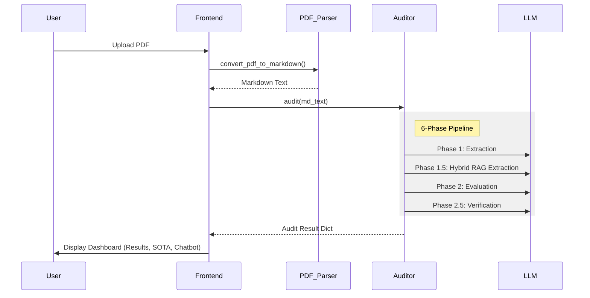

# 02 — Functional Specifications (Consolidated)

This document provides a top-level functional overview of the NeurIPS 2026 Reproducibility Auditor and serves as the entry point to the detailed backend and frontend specifications.

## 1. System Overview

The system is a Streamlit-based web application designed to automate the reproducibility audit of scientific papers. It processes PDF submissions, extracts technical metadata, evaluates compliance with NeurIPS 2026 standards, and provides an interactive dashboard for researchers and reviewers.

### 1.1 Core Components
- **`02_functional_backend.md`**: Authoritative specification for the 6-phase audit pipeline, RAG-based extraction, and LLM orchestration.
- **`02_functional_frontend.md`**: Authoritative specification for the UI components, session state, and dashboard rendering.

## 2. End-to-End Functional Flow

## 3. High-Level Feature Inventory

### 3.1 Automated Auditing
- **NeurIPS Checklist**: Validation against 16 key transparency criteria.
- **Red Flag Detection**: Regex-based identification of proprietary data, missing code, or hardware omissions.
- **Strict Verification**: A "two-auditor" approach where a second LLM pass validates the initial findings.

### 3.2 Literature Analysis (SOTA)
- **Semantic Scholar Integration**: Real-time search for related work.
- **Gap Detection**: Identification of subtopics not sufficiently covered in the paper's references.

### 3.3 Interactive Q&A
- **Context-Aware Chatbot**: A specialized bot that answers questions specifically about the audited paper using a "Senior Area Chair" persona.

### 3.4 Reporting
- **PDF/Markdown Reports**: Generation of formal audit summaries for download.
- **Visual Compliance**: Gauge charts and color-coded tables for immediate feedback.

## 4. Cross-Cutting Concerns
- **Session State**: Maintains data consistency across the single-page application.
- **Error Handling**: Robust retry logic for LLM API calls and fallback mechanisms for extraction failures.
- **Performance**: MAP/REDUCE strategy to handle long papers without hitting token limits.
