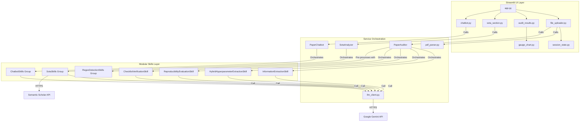

# 08 — Dependency Graph

This document provides a comprehensive visualization and inventory of the system's dependencies, highlighting the interactions between the frontend, backend core services, and the modular skills architecture.

## 1. System Architecture Diagram

## 2. Core Service Dependencies

| Service | Responsibility | Key Dependencies |
|---|---|---|
| **`PaperAuditor`** | 6-phase audit pipeline orchestrator | `LLMClient`, `InformationExtractionSkill`, `HybridHyperparameterExtractionSkill`, `ReproducibilityEvaluationSkill`, `ChecklistVerificationSkill`, `MetricsCalculationSkill`, `MetadataAggregationSkill`. |
| **`PaperChatbot`** | RAG-less conversational Q&A | `LLMClient`, `ConversationalResponseSkill`, `ContextValidationSkill`. |
| **`SotaAnalyzer`** | Literature analysis pipeline | `LLMClient`, `ThematicCoverageSkill`, `QueryGenerationSkill`, `SemanticScholarSearchSkill`, `CoverageGapAnalysisSkill`, `CrossValidationSkill`. |
| **`LLMClient`** | Google Gemini API wrapper | `google-generativeai`, `httpx` (for embeddings). |

## 3. Skill Architecture (Inheritance)

All technical logic is encapsulated in "Skills" that inherit from a common base:

- **`BaseSkill`** (`base_skill.py`): The abstract base class defining the `execute()` interface.
- **`CompositeSkill`**: A wrapper to chain multiple skills sequentially.
- **Functional Groups**:
    - **Extraction**: `InformationExtractionSkill`, `HybridHyperparameterExtractionSkill`.
    - **Evaluation**: `ReproducibilityEvaluationSkill`, `ChecklistVerificationSkill`.
    - **Detection**: `LimitationsQualityDetectionSkill`, `SoftwareVersionDetectionSkill`, `HardwareDetailDetectionSkill`, etc.

## 4. Cross-Module Data Flow

| Sequence | Source | Target | Data Object |
|---|---|---|---|
| **1. PDF Conversion** | `file_uploader.py` | `pdf_parser.py` | PDF Bytes → Markdown String |
| **2. Initial Signals** | `PaperAuditor.audit` | `RegexDetectionSkills` | Markdown → `red_flags` dict |
| **3. Main Audit** | `PaperAuditor.audit` | `AuditorSkills` | Markdown + Flags → `resultado` dict |
| **4. Display** | `app.py` | `audit_results.py` | `resultado` → HTML/Plotly UI |

## 5. External System Dependencies

- **Google Gemini API**: Used for all generative tasks (extraction, evaluation, reasoning).
- **Google Embedding API**: Used for RAG retrieval in the Hybrid Hyperparameter phase.
- **Semantic Scholar API**: Used to fetch recent literature and citation data.
- **Docling**: Used for high-fidelity PDF to Markdown conversion.
- **ChromaDB**: In-memory vector database used for local RAG context management.
